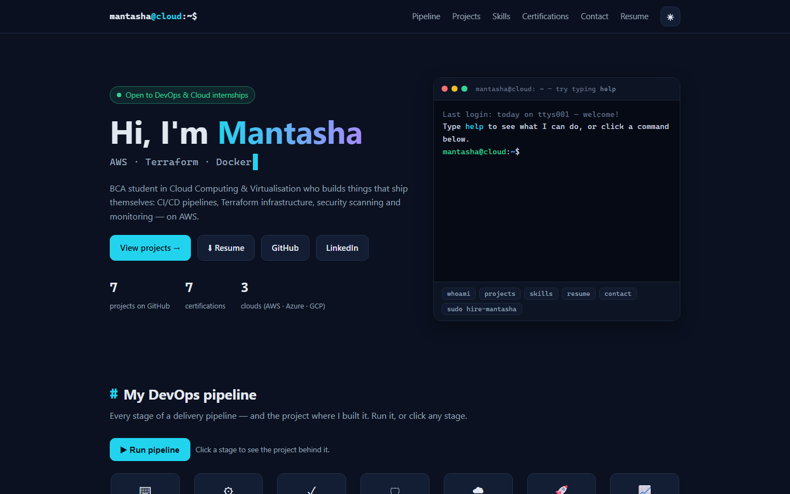

# AWS Static Website Hosting — EC2 + Nginx and Amazon S3

[](https://d3bslefzqkag99.cloudfront.net)


**Live portfolio:** https://d3bslefzqkag99.cloudfront.net (CloudFront + Amazon S3)
· S3 origin: http://mantasha-portfolio-2026.s3-website.ap-south-1.amazonaws.com

[](https://d3bslefzqkag99.cloudfront.net)

Two ways to host a static website on AWS, side by side:

| | Method 1: EC2 + Nginx | Method 2: Amazon S3 |
|---|---|---|
| **What's hosted** | `index.html` (assignment page) | [`portfolio/`](portfolio/) — Mantasha's interactive portfolio |
| **You manage** | A Linux server: OS updates, Nginx, firewall | Nothing — AWS runs the web serving |
| **Scaling** | One instance (add a load balancer to scale) | Automatic |
| **Cost** | Pay per hour the instance runs (free tier: t3.micro) | Pay per GB stored + requests (pennies for a small site) |
| **Best for** | Sites that later need server-side code | Pure static sites (HTML/CSS/JS) |

---

## Method 1 — Static site on EC2 + Nginx

```
Browser ──HTTP:80──> [ AWS EC2 (Ubuntu 24.04) ]
                          │
                          └── Nginx ──serves──> /var/www/html/index.html
SSH:22 ──> EC2 (admin access)
```

**AWS services used:** EC2, Security Groups, Key Pair. **Bonus:** Nginx restart shell script.

> The EC2 instance has been shut down to avoid charges, so the old public IP no
> longer serves this site. Follow the steps below to bring it up again.

### 1. Launch the EC2 instance

1. AWS Console → **EC2** → **Launch instance**.
2. Name: `devops-assignment`. AMI: **Ubuntu Server 24.04 LTS**. Type: **t3.micro** (free tier).
3. Create a key pair (`.pem`), download it.
4. **Security Group** — allow inbound:
   | Type  | Port | Source     |
   |-------|------|------------|
   | SSH   | 22   | My IP      |
   | HTTP  | 80   | 0.0.0.0/0  |
5. Launch, then copy the **Public IPv4 address**.

### 2. Connect via SSH

```bash
chmod 400 devops-key.pem
ssh -i devops-key.pem ubuntu@<EC2_PUBLIC_IP>
```

### 3. Install & configure Nginx (run on the EC2 instance)

```bash
sudo apt update && sudo apt upgrade -y      # update packages
sudo apt install nginx -y                   # install Nginx
sudo systemctl status nginx                 # check status (should be "active (running)")
sudo systemctl restart nginx                # restart Nginx

# Linux basics checks
df -h                                        # disk usage
free -h                                      # memory usage
ps aux --sort=-%mem | head                   # running processes
```

### 4. Deploy the website

```bash
# From your local machine, copy index.html to the instance:
scp -i devops-key.pem index.html ubuntu@<EC2_PUBLIC_IP>:/tmp/

# On the instance, replace the default Nginx page:
sudo cp /tmp/index.html /var/www/html/index.html
sudo systemctl restart nginx
```

Open `http://<EC2_PUBLIC_IP>` in a browser — the custom page should load.

### 5. Bonus — restart script

`restart-nginx.sh` restarts Nginx and reports status:

```bash
chmod +x restart-nginx.sh
./restart-nginx.sh
```

---

## Method 2 — Portfolio on Amazon S3 + CloudFront

```
Browser ──HTTPS──> CloudFront (edge cache, HTTP→HTTPS redirect)
                        │
                        └──HTTP──> S3 website endpoint ──> bucket: index.html, error.html, Mantasha_Resume.pdf
                                          ▲
Laptop ── deploy.sh (aws s3 sync) ────────┘
```

**AWS services used:** S3 (static website hosting, bucket policy, Block Public Access),
CloudFront (HTTPS, edge caching), IAM, AWS Budgets (zero-spend alert).

### Security design

- **Bucket policy** ([`s3/bucket-policy.json`](s3/bucket-policy.json)) allows the public to
  *read* objects (`s3:GetObject`) and nothing else — no listing, no uploads.
- **Block Public Access** stays on for ACLs; only the bucket policy may grant public read.
- **HTTPS only for visitors** — CloudFront redirects `http://` to `https://`.
- **No root keys** — the CLI uses a dedicated IAM user, and keys live only in `~/.aws/credentials`.
- **Least-privilege policy for deploys** ([`s3/iam-deploy-policy.json`](s3/iam-deploy-policy.json)):
  list, upload and delete files in **this one bucket** and refresh **this one CloudFront
  distribution** — nothing else. The one-time setup (creating the bucket and distribution)
  needs broader rights; step 4 below swaps those for this policy.

### 0. Install the AWS CLI (one time)

Windows (PowerShell):

```powershell
winget install Amazon.AWSCLI
```

Then close and reopen the terminal and check: `aws --version`.
Run the scripts below from **Git Bash** (installed with Git for Windows).

### 1. Credentials

1. AWS Console → **IAM** → **Users** → **Create user** (`portfolio-deployer`) with
   `AmazonS3FullAccess` and `CloudFrontFullAccess` for the one-time setup.
2. Open the user → **Security credentials** → **Create access key** → *Command Line Interface*.
3. On the laptop:
   ```bash
   aws configure        # paste the key + secret, region: ap-south-1, output: json
   ```

> Never commit access keys. They live only in `~/.aws/credentials`.

### 2. Create the website bucket

Bucket names are global across all of AWS, so pick something unique:

```bash
cd s3
./setup.sh mantasha-portfolio-2026
```

This creates the bucket in `ap-south-1` (Mumbai), enables static website hosting with
`index.html` / `error.html`, and applies the public-read bucket policy.

### 3. Deploy the portfolio

```bash
./deploy.sh mantasha-portfolio-2026
```

It uploads `portfolio/` with `aws s3 sync --delete` (HTML is sent with `no-cache` so
updates appear immediately) and prints the live URL:

```
http://mantasha-portfolio-2026.s3-website.ap-south-1.amazonaws.com
```

Edit anything in `portfolio/` and run `./deploy.sh` again to update the live site.

### 4. (Recommended) Lock the deploy user down to least privilege

Once the bucket and CloudFront distribution exist, day-to-day deploys need far less access.

1. IAM → **Policies** → **Create policy** → JSON → paste
   [`s3/iam-deploy-policy.json`](s3/iam-deploy-policy.json), replacing `BUCKET_NAME`,
   `ACCOUNT_ID` and `DISTRIBUTION_ID` with your values.
2. Attach it to `portfolio-deployer`, then detach `AmazonS3FullAccess` and `CloudFrontFullAccess`.
3. `./deploy.sh mantasha-portfolio-2026` keeps working — but the key can no longer touch
   any other bucket or AWS service.

### 5. Tear down

```bash
./teardown.sh mantasha-portfolio-2026
```

Asks you to type the bucket name, then deletes all files and the bucket.

### Troubleshooting

| Symptom | Fix |
|---|---|
| `AccessDenied` on `put-bucket-policy` | Account-level Block Public Access is on: S3 console → **Block Public Access settings for this account** → uncheck *block public bucket policies*, then re-run `setup.sh`. |
| `BucketAlreadyExists` | Someone else owns that name — choose another. |
| `403 Forbidden` in the browser | The bucket policy isn't applied — re-run `setup.sh`. |
| `404` for the homepage | Nothing deployed yet — run `deploy.sh`. |

### HTTPS with CloudFront

S3 website endpoints are HTTP only, and phones/browsers that try `https://` first
fail to open them. A **CloudFront** distribution sits in front of the bucket:

```
Browser ──HTTPS──> CloudFront (edge cache, *.cloudfront.net certificate)
                        └──HTTP──> S3 website endpoint
```

- Config: [`s3/cloudfront.json`](s3/cloudfront.json) — origin is the S3 website
  endpoint, viewers are redirected from HTTP to HTTPS, managed `CachingOptimized` policy.
- Create it once:
  `aws cloudfront create-distribution --distribution-config file://s3/cloudfront.json`
- HTML is uploaded with `no-cache`, so page edits show up right after `deploy.sh`.
  Other files (e.g. the resume PDF) can be cached for up to a day; to refresh at once:
  `aws cloudfront create-invalidation --distribution-id <ID> --paths "/*"`

Next step: a custom domain (Route 53 or any registrar + an ACM certificate in us-east-1).

---

## What I learned

- **Server vs serverless hosting** — on EC2 I manage the OS, Nginx and firewall myself;
  on S3 + CloudFront AWS runs the servers and I only ship files.
- **Automation over clicking** — `setup.sh` / `deploy.sh` turn a 15-click console process
  into two repeatable commands, built on the AWS CLI.
- **Access control in layers** — bucket policies vs ACLs, Block Public Access, security
  groups, and why a deploy key should only reach one bucket (least privilege).
- **HTTPS and CDNs** — S3 website endpoints are HTTP only; CloudFront adds TLS, redirects
  HTTP to HTTPS and caches the site at edge locations. Caching also means thinking about
  `Cache-Control` headers and invalidations.
- **Cost awareness** — a stopped EC2 instance still bills for its disk, a static site on
  S3 costs almost nothing, and a zero-spend budget alert catches surprises early.

---

## Files in this repo

| File | Purpose |
|---|---|
| `index.html` | Method 1 — the page served by Nginx on EC2 |
| `restart-nginx.sh` | Method 1 — validate config and restart Nginx |
| `portfolio/` | Method 2 — the portfolio site (`index.html`, `error.html`, resume PDF) |
| `s3/setup.sh` | Method 2 — create the bucket and enable website hosting |
| `s3/deploy.sh` | Method 2 — upload the portfolio (`aws s3 sync`) |
| `s3/teardown.sh` | Method 2 — delete the bucket |
| `s3/bucket-policy.json` | Public read of website files only |
| `s3/iam-deploy-policy.json` | Least-privilege policy for day-to-day deploys (one bucket + one distribution) |
| `s3/cloudfront.json` | CloudFront distribution config (HTTPS in front of the bucket) |
| `docs/images/portfolio.png` | Screenshot of the live portfolio |
| `DOCUMENTATION.md` | Full report for the original EC2 assignment |
